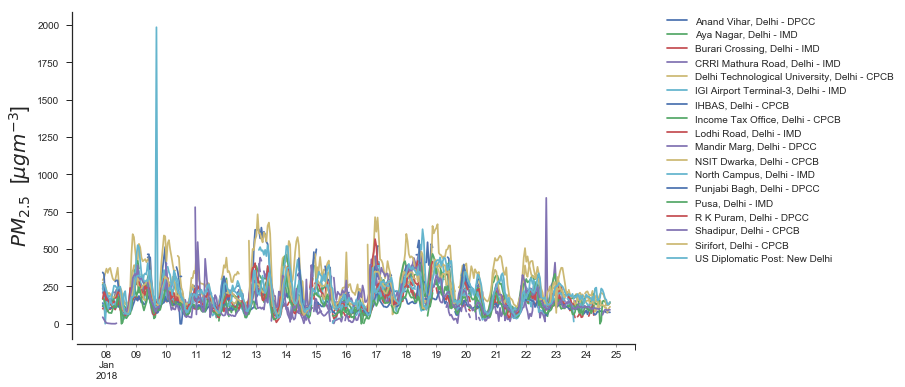
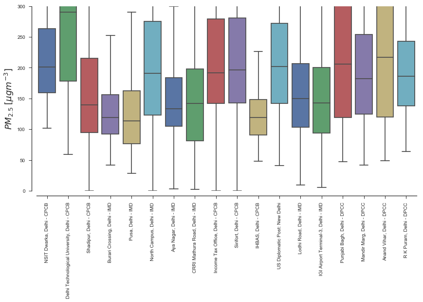
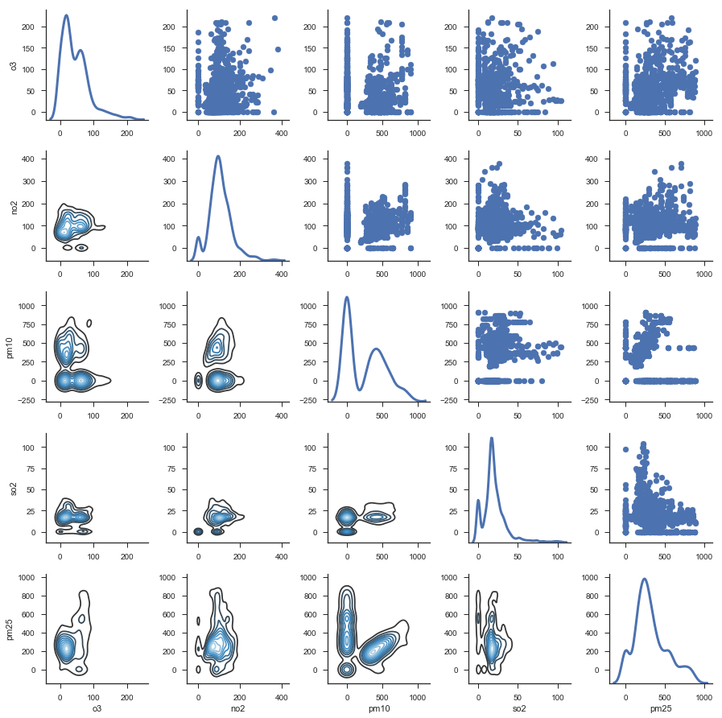
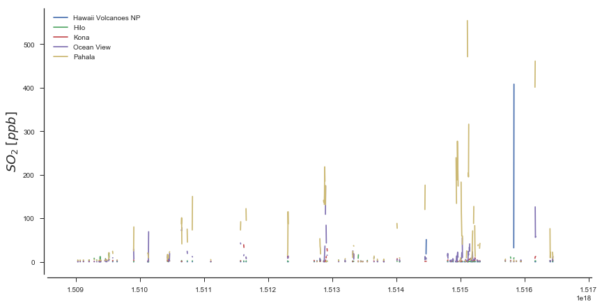

.. _api_tutorial:

Using the OpenAQ API
====================

The ``openaq`` api is an easy-to-use wrapper built around the `OpenAQ
Api <https://docs.openaq.org/>`__. Complete API documentation can be
found on their website.

There are no keys or rate limits (as of March 2017), so working with the
API is straight forward. If building a website or app, you may want to
just use the python wrapper and interact with the data in json format.
However, the rest of this tutorial will assume you are interested in
analyzing the data. To get more out of it, I recommend installing
``seaborn`` for manipulating the asthetics of plots, and working with
data as DataFrames using ``pandas``. For more information on these,
check out the installation section of this documentation.

From this point forward, I assume you have at least a basic knowledge of
python and matplotlib. This documentation was built using the following
versions of all packages:

.. code:: ipython3

    import pandas as pd
    import seaborn as sns
    import matplotlib as mpl
    import matplotlib.pyplot as plt
    import openaq
    import warnings
    
    warnings.simplefilter('ignore')
    
    %matplotlib inline
    
    # Set major seaborn asthetics
    sns.set("notebook", style='ticks', font_scale=1.0)
    
    print ("pandas v{}".format(pd.__version__))
    print ("matplotlib v{}".format(mpl.__version__))
    print ("seaborn v{}".format(sns.__version__))
    print ("openaq v{}".format(openaq.__version__))

.. parsed-literal::

    pandas v0.21.0
    matplotlib v2.1.0
    seaborn v0.8.1
    openaq v1.1.0

OpenAQ API
----------

The OpenAQ APi has only eight endpoints that we are interested in:

-  cities: provides a simple listing of cities within the platforms
-  countries: provides a simple listing of countries within the platform
-  fetches: providing data about individual fetch operations that are
   used to populate data in the platform
-  latest: provides the latest value of each available parameter for
   every location in the system
-  locations: provides a list of measurement locations and their meta
   data
-  measurements: provides data about individual measurements
-  parameters: provides a simple listing of parameters within the
   platform
-  sources: provides a list of data sources

For detailed documentation about each one in the context of this API
wrapper, please check out the API documentation.

Your First Request
~~~~~~~~~~~~~~~~~~

Real quick, let’s go ahead and initiate an instance of the
``openaq.OpenAQ`` class so we can begin looking at data:

.. code:: ipython3

    api = openaq.OpenAQ()

Cities
~~~~~~

The cities API endpoint lists the cities available within the platform.
Results can be subselected by country and paginated to retrieve all
results in the database. Let’s start by performing a basic query with an
increased limit (so we can get all of them) and return it as a
DataFrame:

.. code:: ipython3

    resp = api.cities(df=True, limit=10000)
    
    # display the first 10 rows
    resp.info()

.. parsed-literal::

    <class 'pandas.core.frame.DataFrame'>
    RangeIndex: 2020 entries, 0 to 2019
    Data columns (total 4 columns):
    city         2020 non-null object
    count        2020 non-null int64
    country      2020 non-null object
    locations    2020 non-null int64
    dtypes: int64(2), object(2)
    memory usage: 63.2+ KB

So we retrieved 1400+ entries from the database. We can then take a look
at them:

.. code:: ipython3

    print (resp.head(10))

.. parsed-literal::

                                               city   count country  locations
    0                            Escaldes-Engordany   13281      AD          2
    1                                        unused     314      AD          1
    2                                     Abu Dhabi     471      AE          1
    3                                  Buenos Aires   14976      AR          4
    4                                       Austria  121987      AT        174
    5      Amt der Burgenländischen Landesregierung     471      AT          1
    6              Gemeinde Wien, MA22 Umweltschutz  130328      AT         21
    7              Amt der K�rntner Landesregierung  104663      AT         16
    8  Amt der Ober�sterreichischen Landesregierung  154329      AT         16
    9      Amt der Steierm�rkischen Landesregierung  320372      AT         41

Let’s try to find out which ones are in India:

.. code:: ipython3

    print (resp.query("country == 'IN'"))

.. parsed-literal::

                       city    count country  locations
    841           Bengaluru   371331      IN          8
    842             Asansol     1482      IN          2
    843               Delhi  1139583      IN         35
    844       Visakhapatnam   208237      IN          8
    845           Hyderabad   465489      IN         15
    846           Faridabad   113416      IN          2
    847              Jaipur   190189      IN          6
    848              Howrah    50158      IN          4
    849          Vijayawada    11530      IN          2
    850                Gaya    76745      IN          1
    851              Ujjain    16806      IN          1
    852             Jodhpur   151092      IN          1
    853             Kolkata   168530      IN          7
    854            Varanasi   181578      IN          1
    855              Haldia   115212      IN          2
    856          Vijayawara    34902      IN          1
    857            Durgapur    78697      IN          2
    858             Lucknow   271614      IN          5
    859             Chennai   290187      IN          4
    860           Amaravati    11330      IN          1
    861    Mandi Gobindgarh    48579      IN          1
    862          Jorapokhar    35460      IN          1
    863              Nagpur    72268      IN          5
    864           Ghaziabad    98962      IN          2
    865               Alwar    13937      IN          1
    866           Singrauli    14488      IN          1
    867            Tirupati   158998      IN          4
    868                Kota    23162      IN          2
    869             Gurgaon   147795      IN          1
    870              Mumbai   309353      IN          3
    ..                  ...      ...     ...        ...
    873   Rajamahendravaram    30508      IN          3
    874             Solapur   253903      IN          1
    875               NOIDA    12057      IN          1
    876           Pithampur    12068      IN          1
    877                Pali    23555      IN          2
    878              Nashik    76122      IN          4
    879             Dhanbad        3      IN          1
    880          Barddhaman     2470      IN          3
    881            Siliguri       30      IN          2
    882               Thane   129908      IN          3
    883            Ludhiana    72200      IN          1
    884           Mandideep     7739      IN          1
    885          Chandrapur   232062      IN          2
    886            Amritsar    77741      IN          1
    887           Moradabad    24560      IN          1
    888  Thiruvananthapuram    46029      IN          2
    889                Agra    84253      IN          1
    890           Ahmedabad    57614      IN          2
    891            Chittoor     2013      IN          1
    892                Pune   145350      IN          1
    893             Udaipur    25585      IN          1
    894         Muzaffarpur   116766      IN          1
    895              Rohtak    94980      IN          1
    896         Navi Mumbai     7692      IN          1
    897               Ajmer    25170      IN          2
    898               Dewas    11575      IN          1
    899               Patna    75238      IN          1
    900           Panchkula   144839      IN          1
    901               Medak     2671      IN          1
    902             Bhiwadi    20804      IN          1
    
    [62 rows x 4 columns]

Great! For the rest of the tutorial, we are going to focus on Delhi,
India. Why? Well..because there are over 500,000 data points and my
personal research is primarily in India. We will also take a look at
some :math:`SO_2` data from Hawai’i later on (another great research
locale).

Countries
---------

Similar to the ``cities`` endpoint, the ``countries`` endpoint lists the
countries available. The only parameters we have to play with are the
limit and page number. If we want to grab them all, we can just up the
limit to the maximum (10000).

.. code:: ipython3

    res = api.countries(limit=10000, df=True)
    
    print (res)

.. parsed-literal::

        cities code     count  locations  \
    0        2   AD     13595          3   
    1        1   AR     14976          4   
    2       18   AU   3244816         98   
    3       16   AT   1521351        306   
    4        1   BH     13808          1   
    5        1   BD     16085          2   
    6       14   BE   1204035        191   
    7        8   BA    678241         17   
    8       72   BR   2812094        119   
    9       11   CA   2126036        165   
    10     138   CL   4225918        113   
    11      21   CN    315690         74   
    12       1   CO     14775          1   
    13      16   HR    235285         49   
    14      15   CZ   1173536        199   
    15       7   DK    173235         25   
    16       1   ET     20253          2   
    17      35   FI    535771        107   
    18     134   FR   6243805       1170   
    19      36   DE   6603859       1026   
    20       1   GH      1595         11   
    21       2   GI     32910          6   
    22       9   HK     37172         16   
    23      14   HU    418855         50   
    24      62   IN   6959673        171   
    25       2   ID     36339          3   
    26       9   IE     81083         24   
    27      14   IL  52046055        136   
    28      45   IT    447993        104   
    29       1   XK     14208          1   
    ..     ...  ...       ...        ...   
    34      16   MK    312961         30   
    35       4   MT     37251          4   
    36       5   MX   1794518         95   
    37      25   MN   2097585         40   
    38       1   NP     23837          4   
    39      68   NL   5033365        112   
    40       1   NG      2541          1   
    41      31   NO   1074467         69   
    42       1   PE    433262         11   
    43       1   PH       958          1   
    44      10   PL    547921         16   
    45      15   PT    135536         60   
    46       1   RU    187117         49   
    47       4   RS     12194          5   
    48       1   SG      1275          1   
    49       8   SK    310143         38   
    50       8   SI     22749          8   
    51       1   ZA    160479         11   
    52     115   ES   7833242       1066   
    53       1   LK      2077          1   
    54       3   SE    186898         13   
    55      14   CH    217086         24   
    56      30   TW   2743227         77   
    57      33   TH   2595133         63   
    58      40   TR   3611182        138   
    59       1   UG      6651          1   
    60       1   AE       471          1   
    61     112   GB   5142316        162   
    62     744   US  27605963       1930   
    63       2   VN     33064          3   
    
                                              name  
    0                                      Andorra  
    1                                    Argentina  
    2                                    Australia  
    3                                      Austria  
    4                                      Bahrain  
    5                                   Bangladesh  
    6                                      Belgium  
    7                       Bosnia and Herzegovina  
    8                                       Brazil  
    9                                       Canada  
    10                                       Chile  
    11                                       China  
    12                                    Colombia  
    13                                     Croatia  
    14                              Czech Republic  
    15                                     Denmark  
    16                                    Ethiopia  
    17                                     Finland  
    18                                      France  
    19                                     Germany  
    20                                       Ghana  
    21                                   Gibraltar  
    22                                   Hong Kong  
    23                                     Hungary  
    24                                       India  
    25                                   Indonesia  
    26                                     Ireland  
    27                                      Israel  
    28                                       Italy  
    29                                      Kosovo  
    ..                                         ...  
    34  Macedonia, the Former Yugoslav Republic of  
    35                                       Malta  
    36                                      Mexico  
    37                                    Mongolia  
    38                                       Nepal  
    39                                 Netherlands  
    40                                     Nigeria  
    41                                      Norway  
    42                                        Peru  
    43                                 Philippines  
    44                                      Poland  
    45                                    Portugal  
    46                          Russian Federation  
    47                                      Serbia  
    48                                   Singapore  
    49                                    Slovakia  
    50                                    Slovenia  
    51                                South Africa  
    52                                       Spain  
    53                                   Sri Lanka  
    54                                      Sweden  
    55                                 Switzerland  
    56                   Taiwan, Province of China  
    57                                    Thailand  
    58                                      Turkey  
    59                                      Uganda  
    60                        United Arab Emirates  
    61                              United Kingdom  
    62                               United States  
    63                                    Viet Nam  
    
    [64 rows x 5 columns]

Fetches
-------

If you are interested in getting information pertaining to the
individual data fetch operations, go ahead and use this endpoint. Most
people won’t need to use this. This API method does not allow the ``df``
parameter; if you would like it to be added, drop me a message.

Otherwise, here is how you can access the json-formatted data:

.. code:: ipython3

    status, resp = api.fetches(limit=1)
    
    # Print out the meta info
    print (resp['meta'])

.. parsed-literal::

    {'name': 'openaq-api', 'license': 'CC BY 4.0', 'website': 'https://docs.openaq.org/', 'page': 1, 'limit': 1, 'found': 92463, 'pages': 92463}

Parameters
----------

The ``parameters`` endpoint will provide a listing off all the
parameters available:

.. code:: ipython3

    res = api.parameters(df=True)
    
    print (res)

.. parsed-literal::

                                             description    id   name  \
    0                                       Black Carbon    bc     BC   
    1                                    Carbon Monoxide    co     CO   
    2                                   Nitrogen Dioxide   no2    NO2   
    3                                              Ozone    o3     O3   
    4  Particulate matter less than 10 micrometers in...  pm10   PM10   
    5  Particulate matter less than 2.5 micrometers i...  pm25  PM2.5   
    6                                     Sulfur Dioxide   so2    SO2   
    
      preferredUnit  
    0         µg/m³  
    1           ppm  
    2           ppm  
    3           ppm  
    4         µg/m³  
    5         µg/m³  
    6           ppm  

Sources
-------

The ``sources`` endpoint will provide a list of the sources where the
raw data came from.

.. code:: ipython3

    res = api.sources(df=True)
    
    # Print out the first one
    res.ix[0]

.. parsed-literal::

    active                                                       True
    adapter                                                 arpalazio
    city                                                          NaN
    contacts                                        [info@openaq.org]
    country                                                        IT
    description             Air quality data from Lazio region, Italy
    location                                                      NaN
    name                                                    ARPALAZIO
    organization                                                  NaN
    region                                                      Lazio
    resolution                                                    NaN
    sourceURL                               http://www.arpalazio.net/
    timezone                                                      NaN
    url             http://www.arpalazio.net/main/aria/sci/annoinc...
    Name: 0, dtype: object

Locations
---------

The ``locations`` endpoint will return the list of measurement locations
and their meta data. We can do quite a bit of querying with this one:

Let’s see what the data looks like:

.. code:: ipython3

    res = api.locations(df=True)
    
    res.info()

.. parsed-literal::

    <class 'pandas.core.frame.DataFrame'>
    RangeIndex: 100 entries, 0 to 99
    Data columns (total 11 columns):
    city                     100 non-null object
    coordinates.latitude     100 non-null float64
    coordinates.longitude    100 non-null float64
    count                    100 non-null int64
    country                  100 non-null object
    firstUpdated             100 non-null datetime64[ns]
    lastUpdated              100 non-null datetime64[ns]
    location                 100 non-null object
    parameters               100 non-null object
    sourceName               100 non-null object
    sourceNames              100 non-null object
    dtypes: datetime64[ns](2), float64(2), int64(1), object(6)
    memory usage: 8.7+ KB

.. code:: ipython3

    # print out the first one
    res.ix[0]

.. parsed-literal::

    city                                  Ulaanbaatar
    coordinates.latitude                      47.9329
    coordinates.longitude                     106.921
    count                                      294622
    country                                        MN
    firstUpdated                  2015-09-01 00:00:00
    lastUpdated                   2018-01-23 00:15:00
    location                                  100 ail
    parameters               [no2, so2, o3, pm10, co]
    sourceName                               Agaar.mn
    sourceNames                            [Agaar.mn]
    Name: 0, dtype: object

What if we just want to grab the locations in Delhi?

.. code:: ipython3

    res = api.locations(city='Delhi', df=True)
    
    
    res.ix[0]

.. parsed-literal::

    city                                              Delhi
    coordinates.latitude                            28.6508
    coordinates.longitude                           77.3152
    count                                            102326
    country                                              IN
    firstUpdated                        2015-06-29 14:30:00
    lastUpdated                         2017-11-28 10:15:00
    location                                    Anand Vihar
    parameters               [pm10, so2, co, no2, o3, pm25]
    sourceName                                         CPCB
    sourceNames                         [Anand Vihar, CPCB]
    Name: 0, dtype: object

What about just figuring out which locations in Delhi have
:math:`PM_{2.5}` data?

.. code:: ipython3

    res = api.locations(city='Delhi', parameter='pm25', df=True)
    
    res.ix[0]

.. parsed-literal::

    city                                   Delhi
    coordinates.latitude                 28.6508
    coordinates.longitude                77.3152
    count                                  23891
    country                                   IN
    distance                         1.19047e+07
    firstUpdated             2015-06-29 14:30:00
    lastUpdated              2017-11-28 10:15:00
    location                         Anand Vihar
    parameters                            [pm25]
    sourceName                              CPCB
    sourceNames              [Anand Vihar, CPCB]
    Name: 0, dtype: object

Latest
------

Grab the latest data from a location or locations.

What was the most recent :math:`PM_{2.5}` data in Delhi?

.. code:: ipython3

    res = api.latest(city='Delhi', parameter='pm25', df=True)
    
    res

.. raw:: html

    

    
    <table border="1" class="dataframe">
      <thead>
        <tr style="text-align: right;">
          <th></th>
          <th>averagingPeriod.unit</th>
          <th>averagingPeriod.value</th>
          <th>city</th>
          <th>country</th>
          <th>location</th>
          <th>parameter</th>
          <th>sourceName</th>
          <th>unit</th>
          <th>value</th>
        </tr>
        <tr>
          <th>lastUpdated</th>
          <th></th>
          <th></th>
          <th></th>
          <th></th>
          <th></th>
          <th></th>
          <th></th>
          <th></th>
          <th></th>
        </tr>
      </thead>
      <tbody>
        <tr>
          <th>2017-11-28 10:15:00</th>
          <td>hours</td>
          <td>0.25</td>
          <td>Delhi</td>
          <td>IN</td>
          <td>Anand Vihar</td>
          <td>pm25</td>
          <td>CPCB</td>
          <td>µg/m³</td>
          <td>70.00</td>
        </tr>
        <tr>
          <th>2018-01-22 05:45:00</th>
          <td>hours</td>
          <td>0.25</td>
          <td>Delhi</td>
          <td>IN</td>
          <td>Anand Vihar, Delhi - DPCC</td>
          <td>pm25</td>
          <td>CPCB</td>
          <td>µg/m³</td>
          <td>229.00</td>
        </tr>
        <tr>
          <th>2018-01-24 00:00:00</th>
          <td>hours</td>
          <td>0.25</td>
          <td>Delhi</td>
          <td>IN</td>
          <td>Aya Nagar, Delhi - IMD</td>
          <td>pm25</td>
          <td>CPCB</td>
          <td>µg/m³</td>
          <td>113.89</td>
        </tr>
        <tr>
          <th>2018-01-24 00:00:00</th>
          <td>hours</td>
          <td>0.25</td>
          <td>Delhi</td>
          <td>IN</td>
          <td>Burari Crossing, Delhi - IMD</td>
          <td>pm25</td>
          <td>CPCB</td>
          <td>µg/m³</td>
          <td>128.44</td>
        </tr>
        <tr>
          <th>2018-01-24 00:00:00</th>
          <td>hours</td>
          <td>0.25</td>
          <td>Delhi</td>
          <td>IN</td>
          <td>CRRI Mathura Road, Delhi - IMD</td>
          <td>pm25</td>
          <td>CPCB</td>
          <td>µg/m³</td>
          <td>159.98</td>
        </tr>
        <tr>
          <th>2015-07-10 08:15:00</th>
          <td>hours</td>
          <td>0.25</td>
          <td>Delhi</td>
          <td>IN</td>
          <td>Civil Lines</td>
          <td>pm25</td>
          <td>CPCB</td>
          <td>µg/m³</td>
          <td>48.99</td>
        </tr>
        <tr>
          <th>2017-11-28 10:00:00</th>
          <td>hours</td>
          <td>0.25</td>
          <td>Delhi</td>
          <td>IN</td>
          <td>Delhi Technological University</td>
          <td>pm25</td>
          <td>CPCB</td>
          <td>µg/m³</td>
          <td>76.00</td>
        </tr>
        <tr>
          <th>2018-01-24 01:00:00</th>
          <td>hours</td>
          <td>0.25</td>
          <td>Delhi</td>
          <td>IN</td>
          <td>Delhi Technological University, Delhi - CPCB</td>
          <td>pm25</td>
          <td>CPCB</td>
          <td>µg/m³</td>
          <td>97.00</td>
        </tr>
        <tr>
          <th>2015-07-10 06:30:00</th>
          <td>hours</td>
          <td>0.25</td>
          <td>Delhi</td>
          <td>IN</td>
          <td>IGI Airport</td>
          <td>pm25</td>
          <td>CPCB</td>
          <td>µg/m³</td>
          <td>56.82</td>
        </tr>
        <tr>
          <th>2018-01-23 06:30:00</th>
          <td>hours</td>
          <td>0.25</td>
          <td>Delhi</td>
          <td>IN</td>
          <td>IGI Airport Terminal-3, Delhi - IMD</td>
          <td>pm25</td>
          <td>CPCB</td>
          <td>µg/m³</td>
          <td>106.16</td>
        </tr>
        <tr>
          <th>2017-11-28 10:15:00</th>
          <td>hours</td>
          <td>0.25</td>
          <td>Delhi</td>
          <td>IN</td>
          <td>IHBAS</td>
          <td>pm25</td>
          <td>CPCB</td>
          <td>µg/m³</td>
          <td>70.80</td>
        </tr>
        <tr>
          <th>2018-01-24 00:45:00</th>
          <td>hours</td>
          <td>0.25</td>
          <td>Delhi</td>
          <td>IN</td>
          <td>IHBAS, Delhi - CPCB</td>
          <td>pm25</td>
          <td>CPCB</td>
          <td>µg/m³</td>
          <td>68.80</td>
        </tr>
        <tr>
          <th>2017-11-28 09:45:00</th>
          <td>hours</td>
          <td>0.25</td>
          <td>Delhi</td>
          <td>IN</td>
          <td>Income Tax Office</td>
          <td>pm25</td>
          <td>CPCB</td>
          <td>µg/m³</td>
          <td>60.00</td>
        </tr>
        <tr>
          <th>2018-01-24 00:45:00</th>
          <td>hours</td>
          <td>0.25</td>
          <td>Delhi</td>
          <td>IN</td>
          <td>Income Tax Office, Delhi - CPCB</td>
          <td>pm25</td>
          <td>CPCB</td>
          <td>µg/m³</td>
          <td>211.00</td>
        </tr>
        <tr>
          <th>2018-01-23 10:00:00</th>
          <td>hours</td>
          <td>0.25</td>
          <td>Delhi</td>
          <td>IN</td>
          <td>Lodhi Road, Delhi - IMD</td>
          <td>pm25</td>
          <td>CPCB</td>
          <td>µg/m³</td>
          <td>127.26</td>
        </tr>
        <tr>
          <th>2017-11-28 08:30:00</th>
          <td>hours</td>
          <td>0.25</td>
          <td>Delhi</td>
          <td>IN</td>
          <td>Mandir Marg</td>
          <td>pm25</td>
          <td>CPCB</td>
          <td>µg/m³</td>
          <td>93.00</td>
        </tr>
        <tr>
          <th>2018-01-23 04:30:00</th>
          <td>hours</td>
          <td>0.25</td>
          <td>Delhi</td>
          <td>IN</td>
          <td>Mandir Marg, Delhi - DPCC</td>
          <td>pm25</td>
          <td>CPCB</td>
          <td>µg/m³</td>
          <td>155.00</td>
        </tr>
        <tr>
          <th>2017-11-28 10:30:00</th>
          <td>hours</td>
          <td>0.25</td>
          <td>Delhi</td>
          <td>IN</td>
          <td>NSIT Dwarka</td>
          <td>pm25</td>
          <td>CPCB</td>
          <td>µg/m³</td>
          <td>87.70</td>
        </tr>
        <tr>
          <th>2018-01-24 01:00:00</th>
          <td>hours</td>
          <td>0.25</td>
          <td>Delhi</td>
          <td>IN</td>
          <td>NSIT Dwarka, Delhi - CPCB</td>
          <td>pm25</td>
          <td>CPCB</td>
          <td>µg/m³</td>
          <td>173.40</td>
        </tr>
        <tr>
          <th>2018-01-24 00:00:00</th>
          <td>hours</td>
          <td>0.25</td>
          <td>Delhi</td>
          <td>IN</td>
          <td>North Campus, Delhi - IMD</td>
          <td>pm25</td>
          <td>CPCB</td>
          <td>µg/m³</td>
          <td>180.27</td>
        </tr>
        <tr>
          <th>2017-11-27 08:15:00</th>
          <td>hours</td>
          <td>0.25</td>
          <td>Delhi</td>
          <td>IN</td>
          <td>Punjabi Bagh</td>
          <td>pm25</td>
          <td>CPCB</td>
          <td>µg/m³</td>
          <td>231.00</td>
        </tr>
        <tr>
          <th>2018-01-22 05:30:00</th>
          <td>hours</td>
          <td>0.25</td>
          <td>Delhi</td>
          <td>IN</td>
          <td>Punjabi Bagh, Delhi - DPCC</td>
          <td>pm25</td>
          <td>CPCB</td>
          <td>µg/m³</td>
          <td>237.00</td>
        </tr>
        <tr>
          <th>2018-01-24 00:00:00</th>
          <td>hours</td>
          <td>0.25</td>
          <td>Delhi</td>
          <td>IN</td>
          <td>Pusa, Delhi - IMD</td>
          <td>pm25</td>
          <td>CPCB</td>
          <td>µg/m³</td>
          <td>91.75</td>
        </tr>
        <tr>
          <th>2017-11-07 07:45:00</th>
          <td>hours</td>
          <td>0.25</td>
          <td>Delhi</td>
          <td>IN</td>
          <td>Pusa2 IMD</td>
          <td>pm25</td>
          <td>CPCB</td>
          <td>µg/m³</td>
          <td>361.89</td>
        </tr>
        <tr>
          <th>2017-11-28 10:15:00</th>
          <td>hours</td>
          <td>0.25</td>
          <td>Delhi</td>
          <td>IN</td>
          <td>R K Puram</td>
          <td>pm25</td>
          <td>CPCB</td>
          <td>µg/m³</td>
          <td>75.00</td>
        </tr>
        <tr>
          <th>2018-01-22 05:30:00</th>
          <td>hours</td>
          <td>0.25</td>
          <td>Delhi</td>
          <td>IN</td>
          <td>R K Puram, Delhi - DPCC</td>
          <td>pm25</td>
          <td>CPCB</td>
          <td>µg/m³</td>
          <td>289.00</td>
        </tr>
        <tr>
          <th>2016-03-22 00:10:00</th>
          <td>NaN</td>
          <td>NaN</td>
          <td>Delhi</td>
          <td>IN</td>
          <td>RK Puram</td>
          <td>pm25</td>
          <td>RK Puram</td>
          <td>µg/m³</td>
          <td>17.00</td>
        </tr>
        <tr>
          <th>2017-11-28 09:45:00</th>
          <td>hours</td>
          <td>0.25</td>
          <td>Delhi</td>
          <td>IN</td>
          <td>Shadipur</td>
          <td>pm25</td>
          <td>CPCB</td>
          <td>µg/m³</td>
          <td>72.50</td>
        </tr>
        <tr>
          <th>2018-01-24 00:45:00</th>
          <td>hours</td>
          <td>0.25</td>
          <td>Delhi</td>
          <td>IN</td>
          <td>Shadipur, Delhi - CPCB</td>
          <td>pm25</td>
          <td>CPCB</td>
          <td>µg/m³</td>
          <td>115.50</td>
        </tr>
        <tr>
          <th>2017-11-28 10:30:00</th>
          <td>hours</td>
          <td>0.25</td>
          <td>Delhi</td>
          <td>IN</td>
          <td>Siri Fort</td>
          <td>pm25</td>
          <td>CPCB</td>
          <td>µg/m³</td>
          <td>61.00</td>
        </tr>
        <tr>
          <th>2018-01-24 00:45:00</th>
          <td>hours</td>
          <td>0.25</td>
          <td>Delhi</td>
          <td>IN</td>
          <td>Sirifort, Delhi - CPCB</td>
          <td>pm25</td>
          <td>CPCB</td>
          <td>µg/m³</td>
          <td>168.00</td>
        </tr>
        <tr>
          <th>2018-01-24 00:30:00</th>
          <td>hours</td>
          <td>1.00</td>
          <td>Delhi</td>
          <td>IN</td>
          <td>US Diplomatic Post: New Delhi</td>
          <td>pm25</td>
          <td>StateAir_NewDelhi</td>
          <td>µg/m³</td>
          <td>156.00</td>
        </tr>
      </tbody>
    </table>
    

What about the most recent :math:`SO_2` data in Hawii?

.. code:: ipython3

    res = api.latest(city='Hilo', parameter='so2', df=True)
    
    res

.. raw:: html

    

    
    <table border="1" class="dataframe">
      <thead>
        <tr style="text-align: right;">
          <th></th>
          <th>averagingPeriod.unit</th>
          <th>averagingPeriod.value</th>
          <th>city</th>
          <th>country</th>
          <th>location</th>
          <th>parameter</th>
          <th>sourceName</th>
          <th>unit</th>
          <th>value</th>
        </tr>
        <tr>
          <th>lastUpdated</th>
          <th></th>
          <th></th>
          <th></th>
          <th></th>
          <th></th>
          <th></th>
          <th></th>
          <th></th>
          <th></th>
        </tr>
      </thead>
      <tbody>
        <tr>
          <th>2018-01-23 09:00:00</th>
          <td>hours</td>
          <td>1</td>
          <td>Hilo</td>
          <td>US</td>
          <td>Hawaii Volcanoes NP</td>
          <td>so2</td>
          <td>AirNow</td>
          <td>ppm</td>
          <td>0.000</td>
        </tr>
        <tr>
          <th>2018-01-23 09:00:00</th>
          <td>hours</td>
          <td>1</td>
          <td>Hilo</td>
          <td>US</td>
          <td>Hilo</td>
          <td>so2</td>
          <td>AirNow</td>
          <td>ppm</td>
          <td>0.002</td>
        </tr>
        <tr>
          <th>2018-01-23 09:00:00</th>
          <td>hours</td>
          <td>1</td>
          <td>Hilo</td>
          <td>US</td>
          <td>Kona</td>
          <td>so2</td>
          <td>AirNow</td>
          <td>ppm</td>
          <td>0.003</td>
        </tr>
        <tr>
          <th>2018-01-23 09:00:00</th>
          <td>hours</td>
          <td>1</td>
          <td>Hilo</td>
          <td>US</td>
          <td>Ocean View</td>
          <td>so2</td>
          <td>AirNow</td>
          <td>ppm</td>
          <td>0.005</td>
        </tr>
        <tr>
          <th>2018-01-23 09:00:00</th>
          <td>hours</td>
          <td>1</td>
          <td>Hilo</td>
          <td>US</td>
          <td>Pahala</td>
          <td>so2</td>
          <td>AirNow</td>
          <td>ppm</td>
          <td>0.026</td>
        </tr>
        <tr>
          <th>2017-01-26 17:00:00</th>
          <td>hours</td>
          <td>1</td>
          <td>Hilo</td>
          <td>US</td>
          <td>Puna E Station</td>
          <td>so2</td>
          <td>AirNow</td>
          <td>ppm</td>
          <td>0.002</td>
        </tr>
      </tbody>
    </table>
    

Measurements
------------

Finally, the endpoint we’ve all been waiting for! Measurements allows
you to grab all of the dataz! You can query on a whole bunhc of
parameters listed in the API documentation. Let’s dive in:

Let’s grab the past 10000 data points for :math:`PM_{2.5}` in Delhi:

.. code:: ipython3

    res = api.measurements(city='Delhi', parameter='pm25', limit=10000, df=True)
    
    # Print out the statistics on a per-location basiss
    res.groupby(['location'])['value'].describe()

.. raw:: html

    

    
    <table border="1" class="dataframe">
      <thead>
        <tr style="text-align: right;">
          <th></th>
          <th>count</th>
          <th>mean</th>
          <th>std</th>
          <th>min</th>
          <th>25%</th>
          <th>50%</th>
          <th>75%</th>
          <th>max</th>
        </tr>
        <tr>
          <th>location</th>
          <th></th>
          <th></th>
          <th></th>
          <th></th>
          <th></th>
          <th></th>
          <th></th>
          <th></th>
        </tr>
      </thead>
      <tbody>
        <tr>
          <th>Anand Vihar, Delhi - DPCC</th>
          <td>446.0</td>
          <td>254.298206</td>
          <td>147.131321</td>
          <td>49.00</td>
          <td>120.0000</td>
          <td>217.000</td>
          <td>342.0000</td>
          <td>644.00</td>
        </tr>
        <tr>
          <th>Aya Nagar, Delhi - IMD</th>
          <td>378.0</td>
          <td>148.879312</td>
          <td>63.427033</td>
          <td>3.00</td>
          <td>105.1750</td>
          <td>133.245</td>
          <td>183.5350</td>
          <td>362.89</td>
        </tr>
        <tr>
          <th>Burari Crossing, Delhi - IMD</th>
          <td>369.0</td>
          <td>129.967073</td>
          <td>54.271662</td>
          <td>41.82</td>
          <td>91.9400</td>
          <td>119.160</td>
          <td>156.2400</td>
          <td>333.67</td>
        </tr>
        <tr>
          <th>CRRI Mathura Road, Delhi - IMD</th>
          <td>367.0</td>
          <td>154.653460</td>
          <td>105.441840</td>
          <td>2.22</td>
          <td>81.4250</td>
          <td>141.950</td>
          <td>198.3250</td>
          <td>842.68</td>
        </tr>
        <tr>
          <th>Delhi Technological University, Delhi - CPCB</th>
          <td>1080.0</td>
          <td>300.384259</td>
          <td>153.859322</td>
          <td>59.00</td>
          <td>178.0000</td>
          <td>290.500</td>
          <td>401.2500</td>
          <td>764.00</td>
        </tr>
        <tr>
          <th>IGI Airport Terminal-3, Delhi - IMD</th>
          <td>368.0</td>
          <td>150.463397</td>
          <td>73.579715</td>
          <td>5.62</td>
          <td>93.7000</td>
          <td>143.065</td>
          <td>199.9500</td>
          <td>375.96</td>
        </tr>
        <tr>
          <th>IHBAS, Delhi - CPCB</th>
          <td>914.0</td>
          <td>123.385120</td>
          <td>45.172724</td>
          <td>0.00</td>
          <td>90.6750</td>
          <td>118.800</td>
          <td>148.0000</td>
          <td>308.30</td>
        </tr>
        <tr>
          <th>Income Tax Office, Delhi - CPCB</th>
          <td>1082.0</td>
          <td>211.280037</td>
          <td>94.686591</td>
          <td>0.00</td>
          <td>142.0000</td>
          <td>192.000</td>
          <td>279.0000</td>
          <td>477.00</td>
        </tr>
        <tr>
          <th>Lodhi Road, Delhi - IMD</th>
          <td>346.0</td>
          <td>158.473353</td>
          <td>72.711477</td>
          <td>9.69</td>
          <td>103.5275</td>
          <td>149.980</td>
          <td>206.5425</td>
          <td>383.10</td>
        </tr>
        <tr>
          <th>Mandir Marg, Delhi - DPCC</th>
          <td>273.0</td>
          <td>194.875458</td>
          <td>88.817554</td>
          <td>42.00</td>
          <td>125.0000</td>
          <td>182.000</td>
          <td>254.0000</td>
          <td>443.00</td>
        </tr>
        <tr>
          <th>NSIT Dwarka, Delhi - CPCB</th>
          <td>1014.0</td>
          <td>219.460059</td>
          <td>81.344030</td>
          <td>0.00</td>
          <td>159.4750</td>
          <td>200.900</td>
          <td>263.0000</td>
          <td>527.10</td>
        </tr>
        <tr>
          <th>North Campus, Delhi - IMD</th>
          <td>373.0</td>
          <td>211.703164</td>
          <td>112.728753</td>
          <td>0.41</td>
          <td>122.8700</td>
          <td>190.840</td>
          <td>275.5500</td>
          <td>633.12</td>
        </tr>
        <tr>
          <th>Punjabi Bagh, Delhi - DPCC</th>
          <td>330.0</td>
          <td>224.296970</td>
          <td>116.611439</td>
          <td>47.00</td>
          <td>119.0000</td>
          <td>206.000</td>
          <td>310.7500</td>
          <td>559.00</td>
        </tr>
        <tr>
          <th>Pusa, Delhi - IMD</th>
          <td>388.0</td>
          <td>123.884716</td>
          <td>58.430448</td>
          <td>28.51</td>
          <td>76.2100</td>
          <td>113.855</td>
          <td>162.1450</td>
          <td>320.82</td>
        </tr>
        <tr>
          <th>R K Puram, Delhi - DPCC</th>
          <td>408.0</td>
          <td>206.649510</td>
          <td>97.904091</td>
          <td>64.00</td>
          <td>138.0000</td>
          <td>186.000</td>
          <td>243.0000</td>
          <td>593.00</td>
        </tr>
        <tr>
          <th>Shadipur, Delhi - CPCB</th>
          <td>1045.0</td>
          <td>165.936364</td>
          <td>104.330173</td>
          <td>0.20</td>
          <td>94.7000</td>
          <td>139.500</td>
          <td>215.1000</td>
          <td>798.70</td>
        </tr>
        <tr>
          <th>Sirifort, Delhi - CPCB</th>
          <td>419.0</td>
          <td>214.608592</td>
          <td>100.762545</td>
          <td>0.00</td>
          <td>143.0000</td>
          <td>196.000</td>
          <td>280.5000</td>
          <td>979.00</td>
        </tr>
        <tr>
          <th>US Diplomatic Post: New Delhi</th>
          <td>400.0</td>
          <td>212.585000</td>
          <td>140.584326</td>
          <td>-999.00</td>
          <td>141.5000</td>
          <td>202.000</td>
          <td>271.5000</td>
          <td>1985.00</td>
        </tr>
      </tbody>
    </table>
    

Clearly, we should be doing some serious data cleaning ;) Why don’t we
go ahead and plot all of these locations on a figure.

.. code:: ipython3

    fig, ax = plt.subplots(1, figsize=(14, 7))
    
    for group, df in res.groupby('location'):
        # Query the data to only get positive values and resample to hourly
        _df = df.query("value >= 0.0").resample('1h').mean()
        
        ax.plot(_df.value, label=group)
        
    ax.legend(loc='best')
    
    sns.despine(offset=5)
    
    plt.show()

Don’t worry too much about how ugly and uninteresting the plot above
is…we’ll take care of that in the next tutorial! Let’s go ahead and look
at the distribution of :math:`PM_{2.5}` values seen in Delhi by various
sensors. This is the same data as above, but viewed in a different way.

.. code:: ipython3

    fig, ax = plt.subplots(1, figsize=(14,7))
    
    ax = sns.boxplot(
        x='location', 
        y='value', 
        data=res.query("value >= 0.0"), 
        fliersize=0, 
        palette='deep',
        ax=ax)
    
    ax.set_ylim([0, 300])
    ax.set_ylabel("$PM_{2.5}\;[\mu gm^{-3}]$", fontsize=18)
    ax.set_xlabel("")
    
    sns.despine(offset=10)
    
    plt.xticks(rotation=90)
    plt.show()

If we remember from above, there was at least one location where many
parameters were measured. Let’s go ahead and look at that location and
see if there is any correlation among parameters!

.. code:: ipython3

    res = api.measurements(city='Delhi', location='Anand Vihar', limit=10000, df=True)
    
    # Which params do we have?
    res.parameter.unique()

.. parsed-literal::

    array(['o3', 'no2', 'pm10', 'so2', 'pm25'], dtype=object)

.. code:: ipython3

    df = pd.DataFrame()
    
    for u in res.parameter.unique():
        _df = res[res['parameter'] == u][['value']]
        _df.columns = [u]
        
        # Merge the dataframes together
        df = pd.merge(df, _df, left_index=True, right_index=True, how='outer')
    
    # Get rid of rows where not all exist
    df.dropna(how='any', inplace=True)
    
    g = sns.PairGrid(df, diag_sharey=False)
    
    g.map_lower(sns.kdeplot, cmap='Blues_d')
    g.map_upper(plt.scatter)
    g.map_diag(sns.kdeplot, lw=3)
    
    plt.show()

For kicks, let’s go ahead and look at a timeseries of :math:`SO_2` data
in Hawai’i. Quiz: What do you expect? Did you know that Hawai’i has a
huge :math:`SO_2` problem?

.. code:: ipython3

    res = api.measurements(city='Hilo', parameter='so2', limit=10000, df=True)
    
    # Print out the statistics on a per-location basiss
    res.groupby(['location'])['value'].describe()

.. raw:: html

    

    
    <table border="1" class="dataframe">
      <thead>
        <tr style="text-align: right;">
          <th></th>
          <th>count</th>
          <th>mean</th>
          <th>std</th>
          <th>min</th>
          <th>25%</th>
          <th>50%</th>
          <th>75%</th>
          <th>max</th>
        </tr>
        <tr>
          <th>location</th>
          <th></th>
          <th></th>
          <th></th>
          <th></th>
          <th></th>
          <th></th>
          <th></th>
          <th></th>
        </tr>
      </thead>
      <tbody>
        <tr>
          <th>Hawaii Volcanoes NP</th>
          <td>352.0</td>
          <td>0.007455</td>
          <td>0.035482</td>
          <td>0.000</td>
          <td>0.000</td>
          <td>0.000</td>
          <td>0.0000</td>
          <td>0.408</td>
        </tr>
        <tr>
          <th>Hilo</th>
          <td>435.0</td>
          <td>0.002492</td>
          <td>0.004502</td>
          <td>0.000</td>
          <td>0.001</td>
          <td>0.001</td>
          <td>0.0020</td>
          <td>0.050</td>
        </tr>
        <tr>
          <th>Kona</th>
          <td>447.0</td>
          <td>0.003268</td>
          <td>0.004278</td>
          <td>0.001</td>
          <td>0.001</td>
          <td>0.002</td>
          <td>0.0040</td>
          <td>0.039</td>
        </tr>
        <tr>
          <th>Ocean View</th>
          <td>452.0</td>
          <td>0.011440</td>
          <td>0.021785</td>
          <td>0.000</td>
          <td>0.001</td>
          <td>0.004</td>
          <td>0.0110</td>
          <td>0.182</td>
        </tr>
        <tr>
          <th>Pahala</th>
          <td>419.0</td>
          <td>0.039153</td>
          <td>0.070539</td>
          <td>0.000</td>
          <td>0.004</td>
          <td>0.010</td>
          <td>0.0395</td>
          <td>0.554</td>
        </tr>
      </tbody>
    </table>
    

.. code:: ipython3

    fig, ax = plt.subplots(1, figsize=(14, 7))
    
    for group, df in res.groupby('location'):
        # Query the data to only get positive values and resample to hourly
        _df = df.query("value >= 0.0").resample('1h').mean()
        
        # Multiply the value by 1000 to get from ppm to ppb
        ax.plot(_df.value * 1000., label=group)
        
    ax.legend(loc='best')
    ax.set_ylabel("$SO_2 \; [ppb]$", fontsize=18)
    
    sns.despine(offset=5)
    
    plt.show()

**NOTE:** These values are for 1h means. The local readings can actually
get much, much higher (>5 ppm!) when looking at 1min data.
